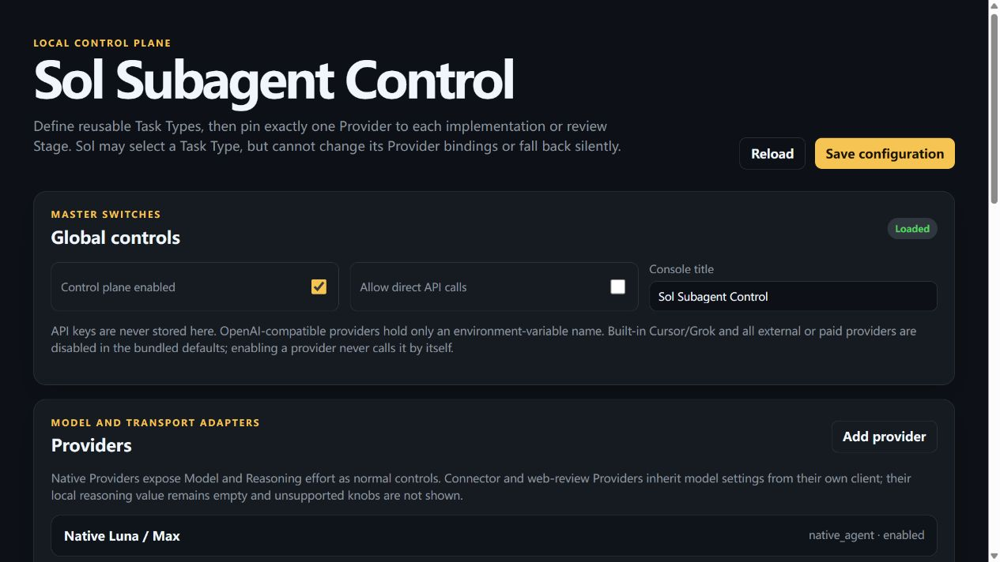
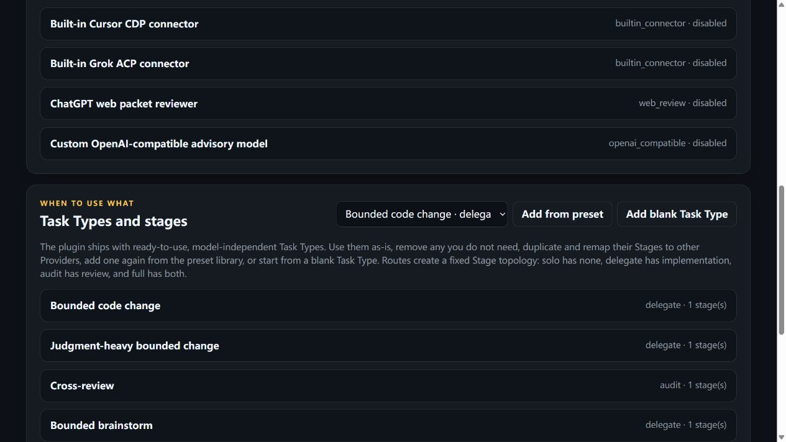

# Sol Subagent Control 使用教程

[English version](TUTORIAL.md)

## 安装后会不会自动调用子 Agent？

不会对所有对话全局自动调用。安装并启用插件只会让 Codex 在**新任务**中可以发现
`$sol-advisor:sol-control-plane` skill 和控制平面工具。如果从插件卡片的默认提示创建任务，默认提示会引用该 skill；其他任务则推荐在第一条消息中明确写：

```text
Use $sol-advisor:sol-control-plane. Keep the primary agent in charge, read metadata once,
select one matching Task Type, and verify every auxiliary claim.
```

skill 激活后，主 Agent 会在第一次仓库/任务工具调用前读取一次经过清理的配置元数据，并选择路线：

- `solo`：主 Agent 自己完成，不调用子 Agent；这是默认路线。
- `delegate`：执行一个实现或分析 Stage。
- `audit`：主 Agent 完成主要工作后，执行一个只读审阅 Stage。
- `full`：依次执行实现和独立审阅；只用于明确的高风险或大范围例外。

只有同时满足以下条件，某个子 Agent 才可能被调用：

1. 当前任务启用了 control-plane skill；
2. 存在与当前任务语义匹配且已启用的 Task Type；
3. 对应 Stage 固定绑定了一个已启用、能力匹配的 Provider；
4. 需要批准时，用户在**当前任务**中明确批准；
5. 写任务还提供了非空、最小化、仓库相对的 `allowed_paths`。

仅启用 Provider 不会触发调用、收费或后台运行。主 Agent 不能临时换 Provider，也不能失败后静默回退。

## 一键打开真实配置控制台

以下脚本读取真实用户配置：

```text
$CODEX_HOME/sol-advisor/control-plane.json
```

未设置 `CODEX_HOME` 时使用：

```text
~/.codex/sol-advisor/control-plane.json
```

这是用户级全局配置，与当前仓库和工作目录无关；保存后，其他项目和新任务读取的是同一份配置。
控制台顶部会明确显示 **Global user configuration** 和实际文件路径。只有开发或测试时显式设置
绝对路径 `SOL_CONTROL_CONFIG`，或由代码传入覆盖路径，才会显示红色的
**Override/test configuration**；这种覆盖不会改写全局配置，不应作为日常入口使用。

控制台概览（截图使用内置默认配置，不包含本机 token 或私人设置）：



Task Type 预设、自定义入口与 Stage 列表：



### Windows

安装后可直接双击插件目录中的：

```text
scripts\open-control-console.cmd
```

也可以从 PowerShell 一键定位并运行：

```powershell
$plugin = (codex plugin list --json | ConvertFrom-Json).installed |
  Where-Object pluginId -eq 'sol-advisor@sol-advisor'
if (-not $plugin) { throw 'sol-advisor is not installed' }
& "$($plugin.source.path)\scripts\open-control-console.cmd"
```

### Linux / macOS / Git Bash

```sh
plugin_dir="$(codex plugin list --json | jq -r '.installed[] | select(.pluginId == "sol-advisor@sol-advisor") | .source.path')"
test -n "$plugin_dir" && test "$plugin_dir" != null || { echo 'sol-advisor is not installed' >&2; exit 1; }
sh "$plugin_dir/scripts/open-control-console.sh"
```

脚本会绑定随机的 `127.0.0.1` 端口并打开浏览器。终端必须保持运行；按 `Ctrl+C` 会关闭本地服务。
不要分享终端可能显示的带 token 本地 URL。也可以指定固定端口，例如：

```powershell
& "$($plugin.source.path)\scripts\open-control-console.cmd" --port 58046
```

```sh
sh "$plugin_dir/scripts/open-control-console.sh" --port 58046
```

在 Codex 对话中说“打开 Sol Subagent Control 配置控制台”仍然是等价的推荐入口。

如果新任务看不到 `sol_control_*` 工具，这是插件 MCP 未激活，不代表配置恢复默认。不要从项目
shell 手动启动服务器，也不要自动切换到另一套路由；先重新加载或更新插件并新建任务。若读取
全局配置只因 `EPERM`/`EACCES` 失败，应只批准上述全局配置目录并重试一次。

## 配置 Task Type、Stage 与 Provider

Provider 只描述“由谁、通过什么连接工作”；Task Type 描述“什么任务、按什么步骤工作”。

1. 在 **Providers** 中启用准备使用的 Provider。
2. 在 **Task Types and stages** 中使用内置预设、复制现有任务或创建空白任务。
3. 在每个 Stage 内选择唯一的 **Pinned provider**。
4. 为只读工作选择 `read_only`；需要修改仓库时选择 `bounded_write` 并开启任务批准。
5. 保存配置。

内置预设是起点，不是封闭清单。可以删除、重新添加、复制、改名、改模板或创建完全自定义的任务类型。
Cursor、Grok、网页审阅和 native agent 都是 Provider，不应该出现在任务类型名称里。

## 第一次实际测试

建议使用一次性 Git 仓库，先只启用一个 Provider。

### 1. 连接探测

```text
Use $sol-advisor:sol-control-plane.
只读取一次 metadata；对 grok-local 调用 sol_connector_probe，workspace 使用当前 Git 仓库根目录。
不要发送任务，也不要把 probe 成功当成任务完成。
```

### 2. 只读任务

创建一个 `read_only` Task Type Stage 并绑定 `grok-local` 或 `cursor-local`，然后说：

```text
Use $sol-advisor:sol-control-plane.
选择我配置的只读测试 Task Type，让其读取 README 的第一个标题。
等待任务完成，报告真实远端身份，并核验 Git 状态完全没有变化。
```

Cursor 应返回 `task_id`、`agent_id`、`target_id`；Grok 应返回 `task_id`、`session_id`、`run_id`。

### 3. 有界写任务

创建一个 `bounded_write` Stage，绑定待测 Provider 并要求批准。然后明确批准一个最小路径：

```text
Use $sol-advisor:sol-control-plane.
我明确批准当前任务调用 grok-local，并且只允许修改 smoke/grok.txt。
选择我配置的有界写测试 Task Type；allowed_paths 必须严格为 ["smoke/grok.txt"]。
完成后检查真实 diff、changed_paths、outside_paths 和 Git 状态，不要只相信子 Agent 的文字结论。
```

只有指定文件发生变化、`outside_paths` 为空、身份连续且主 Agent 完成独立验证时，才算通过。

## 临时关闭

- 控制台中关闭 **Control plane enabled**：不再解析任何控制平面任务。
- 关闭单个 Provider：保留其配置但禁止使用。
- 启动 Codex 前设置 `SOL_CONTROL_DISABLED=1`：环境级 kill switch，控制台不能绕过。
- 关闭一键控制台的终端或按 `Ctrl+C`：只停止配置网页，不会改变已经保存的启用状态。

配置网页只是策略编辑器；真正的调用由新 Codex 任务中的 control-plane skill 和 MCP 工具执行。
当前任务无法读取主模型或 reasoning effort 时，只提醒一次并继续；只有观察到明确不符合要求的
模型或等级时，才停止受控子 Agent 路线。
